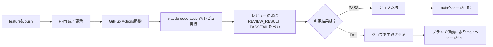

# 基本設計書（作業単位）

## 概要
`anthropics/claude-code-action@v1`（公式のGitHub Actions用アクション）を使い、PR上でのコードレビューと、その結果に基づくマージブロックを実現する。

Anthropicが提供する管理型の「Code Review」機能（Team/Enterpriseプラン限定・マージを強制ブロックしない仕様）は、本プロジェクトの要件（個人プランで利用可能、レビュー未通過ならマージ不可）を満たさないため採用しない。

## 全体の流れ

## 構成要素

### ワークフローファイル
`.github/workflows/claude-review.yml`として作成する。

- トリガー：`pull_request`の`opened`・`synchronize`（PR作成時、および追加push時）
- ジョブ内容：
    1. リポジトリをチェックアウトする
    2. `anthropics/claude-code-action@v1`を実行し、差分に対するコードレビューを行わせる。プロンプトで以下を指示する
        - **FAILとする基準**：正しさに関わるバグ（correctness bug）、セキュリティ上の重大な問題など、実害につながる指摘がある場合
        - **PASSとする基準**：スタイル・命名・将来的な改善提案など軽微な指摘のみの場合（指摘自体はコメントとして残すが、マージはブロックしない）
        - 末尾に`REVIEW_RESULT: PASS`または`REVIEW_RESULT: FAIL`を出力する
    3. 後続のステップで、Claudeの出力から`REVIEW_RESULT`を読み取る
    4. `FAIL`であれば、そのステップで`exit 1`しジョブ全体を失敗させる（→ブランチ保護によりマージ不可になる）
    5. `PASS`であれば、そのステップは何もせず正常終了する。ジョブ全体が成功として記録され、PR画面のチェックが緑になり、ブランチ保護の条件を満たす状態になる。ただし、この時点で自動的にマージされるわけではなく、「Merge」ボタンを押す操作自体は引き続き人が行う
- `id-token: write`権限は、Anthropicへの認証方式（WIF／APIキー）に関わらず必須。`claude-code-action`はPRへのコメント投稿等を行うために、GitHub Appの一時トークンをOIDC経由で取得しており、この権限が無いとAnthropicの認証方式に関係なく失敗する（APIキー方式への切り替え時に一度誤って削除し、再発を確認した）

### 認証情報
- Anthropicの直接APIキーを使用する（`anthropic_api_key`）
- GitHub Secretsに`ANTHROPIC_API_KEY`として登録する（リポジトリの Settings → Secrets and variables → Actions）。値はリポジトリ内のファイルには一切記載しない
- **検討の経緯**：当初はAPIキーを一切保存しない`Workload Identity Federation（WIF）`方式を採用したが、以下の理由からAPIキー方式に戻した。
    - WIF自体（`claude-code-action`のWIF対応、GitHubの「immutable subject claims」仕様）がいずれも比較的新しい機能で、ドキュメントが薄く、実装中に複数の未文書化の挙動（OIDCトークンのsubject claim形式の変更によるルール不一致等）に遭遇し、原因調査に長時間を要した
    - 個人開発・学習目的のプロジェクトでは、APIキー＋Secretsという実績のある枯れた方式の方が、トラブルシューティングのコストを抑えられると判断した
    - 教訓として、「新しくリリースされた機能は、Claude Codeと一緒に使う場合は実績のある方式より数倍のデバッグコストがかかりうる」という点を学んだ

### ブランチ保護ルール
`main`ブランチに対して、GitHubリポジトリの**Rulesets**（Settings → Rules → Rulesets。クラシックな「Settings → Branches」のブランチ保護ルールではない）から設定する。

- `required_status_checks`ルールで、上記ワークフローのジョブ（`review`）を必須ステータスチェックとして指定する
- **Bypass list**に「Repository admin」を追加しておく。デフォルトではリポジトリ所有者でもバイパスできない仕様のため、`claude-review.yml`自体を変更するPR（後述の既知の制約により自動レビューが機能しない）を人の判断でマージできるようにするために必要

## 前提条件
- Anthropic ConsoleでAPIキーを発行できること

## 既知の制約（実装を通して判明）
- `anthropics/claude-code-action`は、PR上のワークフローファイルの内容が`main`上のものと一致しない場合、セキュリティ対策として実行を意図的にスキップする（悪意あるPRがワークフロー自体を改ざんしつつ自己レビューで通過させる攻撃を防ぐ仕様）。そのため、**`claude-review.yml`自体を変更するPRは、原理的に自動レビューを通過できない**。該当するPRは、ブランチ保護のBypass機能を使い、人が手動確認の上でマージする運用とする
- レビュー結果（PASS/FAIL）は、`claude-code-action`の構造化出力ではなく、Claude自身に`review_result.txt`へ書き出させて後続ステップで読む方式で実現している（この方式は認証方式に依存せず機能することを確認済み）
