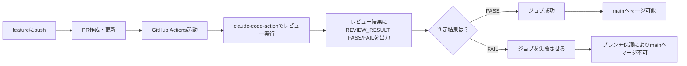

# 基本設計書（作業単位）

## 概要
`anthropics/claude-code-action@v1`（公式のGitHub Actions用アクション）を使い、PR上でのコードレビューと、その結果に基づくマージブロックを実現する。

Anthropicが提供する管理型の「Code Review」機能（Team/Enterpriseプラン限定・マージを強制ブロックしない仕様）は、本プロジェクトの要件（個人プランで利用可能、レビュー未通過ならマージ不可）を満たさないため採用しない。

## 全体の流れ

## 構成要素

### ワークフローファイル
`.github/workflows/claude-review.yml`として作成する。

- トリガー：`pull_request`の`opened`・`synchronize`（PR作成時、および追加push時）
- ジョブ内容：
    1. リポジトリをチェックアウトする
    2. `anthropics/claude-code-action@v1`を実行し、差分に対するコードレビューを行わせる。プロンプトで以下を指示する
        - **FAILとする基準**：正しさに関わるバグ（correctness bug）、セキュリティ上の重大な問題など、実害につながる指摘がある場合
        - **PASSとする基準**：スタイル・命名・将来的な改善提案など軽微な指摘のみの場合（指摘自体はコメントとして残すが、マージはブロックしない）
        - 末尾に`REVIEW_RESULT: PASS`または`REVIEW_RESULT: FAIL`を出力する
    3. 後続のステップで、Claudeの出力から`REVIEW_RESULT`を読み取る
    4. `FAIL`であれば、そのステップで`exit 1`しジョブ全体を失敗させる（→ブランチ保護によりマージ不可になる）
    5. `PASS`であれば、そのステップは何もせず正常終了する。ジョブ全体が成功として記録され、PR画面のチェックが緑になり、ブランチ保護の条件を満たす状態になる。ただし、この時点で自動的にマージされるわけではなく、「Merge」ボタンを押す操作自体は引き続き人が行う

### 認証情報
- Anthropicの直接APIキーを使用する
- GitHub Secretsに`ANTHROPIC_API_KEY`として登録する（リポジトリの Settings → Secrets and variables → Actions）
- リポジトリ内のファイルには一切記載しない（`CLAUDE.md`のデータ取扱いの原則に準拠）

### ブランチ保護ルール
`main`ブランチに対して、GitHubリポジトリのSettings → Branchesから設定する。

- 「Require status checks to pass before merging」を有効化
- 上記ワークフローのジョブを必須ステータスチェックとして指定する

## 前提条件
- Anthropicの開発者アカウント（Anthropic Console）でAPIキーを発行できること。本作業単位専用の新しいAPIキーを発行し、GitHub Secretsにのみ登録する

## 未確定事項
- `claude-code-action@v1`が、実行結果を後続ステップから直接参照できる形（例：`steps.<id>.outputs.*`）で提供しているかは、実装時に公式ドキュメント・実際の挙動で確認する。提供されていない場合は、出力ログをファイルに書き出して`grep`する等の代替手段を取る
