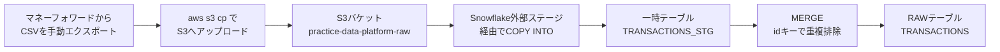

# 基本設計書（作業単位）

## 概要
マネーフォワードのCSVを、手動でS3にアップロードし、SnowflakeのストレージインテグレーションとCOPY INTO/MERGEを使って`RAW`テーブルへ重複排除した状態で取り込む仕組みを構築する。

## 全体の流れ



## AWS側の構成

### S3バケット
- バケット名：`practice-data-platform-raw`
- リージョン：`ap-northeast-1`（東京）
- フォルダ構成：`docs/development-standards.md`1.9の規則（環境／取得元システム／データの種類、さらに`inbox`/`archive`）に従う

```
practice-data-platform-raw/
├── prod/
│   └── moneyforward/
│       └── transactions/
│           ├── inbox/     ← 外部ステージはここを参照する
│           └── archive/   ← 取り込み成功後、ここへ移動する
└── dev/
    └── moneyforward/
        └── transactions/
            ├── inbox/
            └── archive/
```

### IAMロール・ポリシー
環境ごとに1つずつ作成する（システムごとには分割しない。将来システムが増えても、既存ポリシーにプレフィックスを追加するだけで対応する）。

| オブジェクト | 名前 | 内容 |
|---|---|---|
| IAMロール（PROD） | `snowflake-raw-prod-role` | Snowflakeのストレージインテグレーション（PROD）からのAssumeRoleを信頼 |
| IAMロール（DEV） | `snowflake-raw-dev-role` | Snowflakeのストレージインテグレーション（DEV）からのAssumeRoleを信頼 |
| IAMポリシー（PROD） | `snowflake-raw-prod-s3-policy` | `s3://practice-data-platform-raw/prod/*`への読み取り権限のみ |
| IAMポリシー（DEV） | `snowflake-raw-dev-s3-policy` | `s3://practice-data-platform-raw/dev/*`への読み取り権限のみ |

信頼ポリシーの`Principal`・`ExternalId`は、Snowflake側でストレージインテグレーションを作成した際に発行される値（`STORAGE_AWS_IAM_USER_ARN`・`STORAGE_AWS_EXTERNAL_ID`）を使う。そのため、構築順序は「Snowflakeのストレージインテグレーションを先に作成→発行された値をAWSのIAMロールの信頼ポリシーに設定」となる。

## Snowflake側の構成

### ストレージインテグレーション・外部ステージ・ファイルフォーマット
| オブジェクト | 名前 |
|---|---|
| ストレージインテグレーション（PROD） | `RAW_PROD_S3_INTEGRATION` |
| ストレージインテグレーション（DEV） | `RAW_DEV_S3_INTEGRATION` |
| 外部ステージ（PROD） | `RAW_PROD.MONEYFORWARD.S3_STAGE`（`s3://practice-data-platform-raw/prod/moneyforward/transactions/inbox/`を参照） |
| 外部ステージ（DEV） | `RAW_DEV.MONEYFORWARD.S3_STAGE`（`s3://practice-data-platform-raw/dev/moneyforward/transactions/inbox/`を参照） |
| ファイルフォーマット | `MONEYFORWARD_CSV_FORMAT`（各スキーマに作成。CSV・`ENCODING = 'SHIFTJIS'`・`SKIP_HEADER = 1`・`DATE_FORMAT = 'YYYY/MM/DD'`） |

外部ステージの利用権限（`USAGE`）は、PROD用は`LOADER_PROD`のみ、DEV用は`LOADER_DEV`のみに付与する（`docs/architecture.md`のロール設計に準拠）。

### テーブル構成
`RAW_PROD.MONEYFORWARD`・`RAW_DEV.MONEYFORWARD`それぞれに以下を作成する。

- `TRANSACTIONS_STG`：`COPY INTO`の着地先。実行のたびに洗い替える一時的な作業テーブル
- `TRANSACTIONS`：`MERGE`後の本体テーブル。`id`列で重複排除済み

### 列名マッピング（CSV→テーブル）
`docs/development-standards.md`1.4の「取得元の列名が日本語等の場合、値はそのまま列名だけ英語のスネークケースに変換する」というルールに基づく、マネーフォワード固有の対応表。

| CSVの列（日本語ヘッダー） | テーブルの列名 |
|---|---|
| 計算対象 | `is_target` |
| 日付 | `transaction_date` |
| 内容 | `description` |
| 金額（円） | `amount` |
| 保有金融機関 | `institution_name` |
| 大分類 | `category_major` |
| 中分類 | `category_minor` |
| メモ | `memo` |
| 振替 | `is_transfer` |
| ID | `id`（dbtのstaging層で`transaction_id`にリネームする。`docs/architecture.md`参照） |

### 取り込みSQL（概要）
```sql
-- 1. 一時テーブルへ洗い替え
CREATE OR REPLACE TABLE RAW_PROD.MONEYFORWARD.TRANSACTIONS_STG (
    is_target BOOLEAN, transaction_date DATE, description STRING, amount NUMBER,
    institution_name STRING, category_major STRING, category_minor STRING,
    memo STRING, is_transfer BOOLEAN, id STRING
);

COPY INTO RAW_PROD.MONEYFORWARD.TRANSACTIONS_STG
    (is_target, transaction_date, description, amount, institution_name,
     category_major, category_minor, memo, is_transfer, id)
FROM (
    SELECT $1, $2, $3, $4, $5, $6, $7, $8, $9, $10
    FROM @RAW_PROD.MONEYFORWARD.S3_STAGE
)
FILE_FORMAT = (FORMAT_NAME = 'RAW_PROD.MONEYFORWARD.MONEYFORWARD_CSV_FORMAT');

-- 2. idキーでMERGE（重複排除）
MERGE INTO RAW_PROD.MONEYFORWARD.TRANSACTIONS AS target
USING RAW_PROD.MONEYFORWARD.TRANSACTIONS_STG AS source
ON target.id = source.id
WHEN NOT MATCHED THEN INSERT (is_target, transaction_date, description, amount,
    institution_name, category_major, category_minor, memo, is_transfer, id)
    VALUES (source.is_target, source.transaction_date, source.description, source.amount,
    source.institution_name, source.category_major, source.category_minor,
    source.memo, source.is_transfer, source.id);
```
DEV側も同じSQLを`RAW_DEV`・`RAW_DEV.MONEYFORWARD.S3_STAGE`に置き換えて実行する。

既存の`id`に該当する行が再取り込みされた場合は`WHEN NOT MATCHED`のみのため単純にスキップされる（内容が変わっていても更新しない。マネーフォワード側で同じ取引の内容が後から変わるケースは想定しにくいため、まずはこのシンプルな方式とする）。

## ローカルのアップロード・取り込み処理
今回は手動運用のため、以下を1つのスクリプト（`ingestion/`配下）にまとめ、1回の実行で完結させる。

1. アップロード時、ファイル名を**アップロード日時ベースのASCII名**（`transactions_<YYYYMMDDHHMMSS>.csv`）に変換してから`aws s3 cp`でアップロードする
    - マネーフォワードのCSVは元のファイル名が日本語（`収入・支出詳細_...csv`）だが、検証の結果、日本語ファイル名のままアップロードすると、このAWS CLI環境ではS3上のキー名が文字化けすることが判明した（ファイルの中身自体は無事）。S3のキー名はASCIIに統一するのが望ましいため、アップロード時に機械的な名前へ変換する
2. Snowflake CLI（`snow sql -f ...`）で、該当環境の`COPY INTO`＋`MERGE`のSQLを実行する
3. 2.が成功したら、`aws s3 mv`でファイルを`inbox/`から`archive/`へ移動する

ローカルのAWS CLI認証情報は、S3への読み書き権限のみを持つ個人用IAMユーザーを別途作成して設定する（Snowflake用のIAMロールとは別物。ローカル操作者＝自分なので、ユーザーは1つでよい）。

## 前提条件
- AWSアカウントが利用できること（作成済み）
- ローカル環境にAWS CLIがインストールされていること

## 未確定事項
- 列の型（特に`transaction_date`の日付フォーマット、`amount`の桁数等）は、実際の`sample_data/`のCSVを見ながら実装時に確定する
