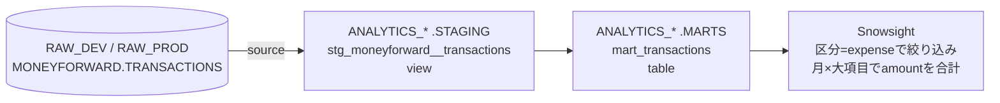

# 基本設計書（作業単位）

> **暫定版**：作業単位ドキュメントの様式（記載ルール）が未整備の状態で作成した（`docs/backlog.md` 023）。

## 概要
dbt Core（`dbt-snowflake`）をPython仮想環境に導入し、`RAW_*.MONEYFORWARD.TRANSACTIONS`を入力として、stagingモデル`stg_moneyforward__transactions`とmartsモデル`mart_transactions`を構築する。`target`（`dev`／`prod`）を切り替えるだけで、参照する`RAW_*`と書き込む`ANALYTICS_*`の組み合わせが丸ごと切り替わるようにする。

## 全体の流れ



## dbt実行環境

### 採用するツール
- **dbt Core**（`pip install dbt-snowflake`）を用いる。dbt Labsの新しい実行エンジン（dbt Fusion）は、新しい機能のため採用しない（定番の方法を優先する方針）

### Python仮想環境
- リポジトリ直下に`.venv/`を作成する（`python -m venv .venv`）。`.venv/`は`.gitignore`で除外済み
- リポジトリ直下に`requirements.txt`を置き、直接利用するパッケージ（`dbt-core`・`dbt-snowflake`）を`==`でバージョン固定する。バージョンは実装時点の最新の安定版とし、ローカルのPython（3.13）で動作することを確認した上で決める
- 依存パッケージ（dbtが内部で使うパッケージ）までは固定しない。全件固定（`pip freeze`の結果をそのまま記載）は再現性が最も高いが、記載が数十行になり更新時の見通しが悪くなるため、個人開発の現段階では直接利用するパッケージの固定に留める
- dbtは`.venv/`にのみ導入し、PC全体のPythonには導入しない。仮想環境を有効化せずに`dbt`を実行するとコマンドが見つからずに失敗するため、ルール違反は自然に検知される

### 接続設定（`profiles.yml`）
- `dbt/profiles.yml`としてリポジトリ内に置き、Git管理する
- アカウント識別子・ユーザー名・秘密鍵のパスは、ファイルに直接書かず環境変数から読み込む（`env_var()`）。リポジトリはpublicのため、アカウント識別子も公開しない
- 認証方式は、既存のSnowflake CLIと同じキーペア認証（`authenticator: snowflake_jwt`）とし、既存の秘密鍵をそのまま使う。秘密鍵の中身はリポジトリにもファイルにも含まれない
- 絶対に漏らしてはならない秘密は、秘密鍵の中身とする。アカウント識別子は、それだけでは悪用できないが攻撃対象の手がかりになるため、公開しない（コストをかけずに避けられるため）。ユーザー名・秘密鍵を置くディレクトリの場所（`C:\Users\tomit\.snowflake\keys\`配下）は、それ自体では悪用できないため秘密としては扱わない。ユーザー名は、障害時の復旧（権限の付け直し等）でインフラ構築のSQLから参照できるほうが都合がよく、既存の`.steering/20260922-snowflake-infra-setup/setup.sql`にも記載されている
- dbtが生成する`target/`・`logs/`・`.user.yml`（接続先の情報がログ等に出ることがある）は、既存の`.gitignore`で除外済み

| 環境変数 | 内容 |
|---|---|
| `SNOWFLAKE_ACCOUNT` | アカウント識別子 |
| `SNOWFLAKE_USER` | ユーザー名 |
| `SNOWFLAKE_PRIVATE_KEY_PATH` | 秘密鍵ファイルのパス（`C:\Users\tomit\.snowflake\keys\`配下） |

- `profiles.yml`には以下の2つの`target`を定義する。既定は`dev`とする

| target | ロール | 書き込み先DB | ウェアハウス |
|---|---|---|---|
| `dev`（既定） | `TRANSFORMER_DEV` | `ANALYTICS_DEV` | `MAIN_WH` |
| `prod` | `TRANSFORMER_PROD` | `ANALYTICS_PROD` | `MAIN_WH` |

#### 検討した選択肢：`profiles.yml`の置き場所
| 案 | 内容 | 評価 |
|---|---|---|
| A. ホームディレクトリ（`~/.dbt/profiles.yml`）に置く | dbtの初期設定のデフォルト。リポジトリ外のため、値を直接書いてもよい | 手軽だが、接続設定がリポジトリから見えず、将来のCD（`docs/backlog.md` 022）で別途用意が必要になる |
| **B. リポジトリ内に置き、値は環境変数から読む（採用）** | 接続設定の構造をGitで管理し、環境ごとの値だけを外から渡す | 接続設定がレビュー対象になり、CDでもそのまま使える。環境変数の設定が一手間増える |

## dbtプロジェクトの構成

```
dbt/
├── dbt_project.yml
├── profiles.yml
├── macros/
│   └── generate_schema_name.sql
├── models/
│   ├── staging/
│   │   └── moneyforward/
│   │       ├── _moneyforward__sources.yml
│   │       ├── _moneyforward__models.yml
│   │       └── stg_moneyforward__transactions.sql
│   └── marts/
│       ├── _marts__models.yml
│       └── mart_transactions.sql
└── tests/
    └── assert_mart_transactions_has_all_rows.sql
```

- `docs/repository-structure.md`の`dbt/`配下の構成に従う。`sources.yml`・`schema.yml`は、dbtのコミュニティ標準に倣い、ディレクトリごとに`_<ディレクトリ名>__sources.yml`・`_<ディレクトリ名>__models.yml`の名前で置く
- `dbt_project.yml`で、レイヤーごとに書き込み先スキーマとマテリアライゼーションを指定する

| レイヤー | 書き込み先スキーマ | マテリアライゼーション | 理由 |
|---|---|---|---|
| staging | `STAGING` | `view` | 最低限のクレンジングのみで、データを複製して持つ必要がない（dbtの標準的な設定） |
| marts | `MARTS` | `table` | Snowsightから繰り返し参照されるため、実体のあるテーブルとして持つ |

## 環境の切り替え

### 書き込み先（`ANALYTICS_*`）
- `profiles.yml`の`target`ごとのDB（`ANALYTICS_DEV`／`ANALYTICS_PROD`）で切り替わる

### 参照先（`RAW_*`）
- `sources.yml`の`database`に、`target`名から参照先DBを組み立てる式を書く（`RAW_{{ target.name | upper }}`）。`target: dev`なら`RAW_DEV`、`target: prod`なら`RAW_PROD`を参照する
- これにより、`target`を1つ切り替えるだけで参照先と書き込み先の組み合わせが丸ごと切り替わり、環境を跨いだ参照は構造的に起こらない。また、`TRANSFORMER_DEV`は`RAW_PROD`への権限を持たないため、仮に設定を誤っても権限エラーで止まる
- `target`名は`dev`／`prod`の2つに限定する（それ以外の名前だと参照先DBが存在しない）

### 閲覧用ロール（`REPORTER_*`）の権限
- dbtが作成した`MARTS`スキーマのテーブル・ビューを`REPORTER_*`が参照できるよう、インフラ構築時にスキーマ単位のfuture grants（今後作成されるテーブル・ビューへの`SELECT`権限）を付与済み（`.steering/20260922-snowflake-infra-setup/setup.sql`）。dbtの`table`マテリアライゼーションはテーブルを作り直すが、作り直されたテーブルにもfuture grantsが適用されるため、dbt側（`grants`設定）では権限を付与しない

### スキーマ名（`generate_schema_name`マクロ）
- dbtの既定では、カスタムスキーマを指定すると`<target のスキーマ>_<カスタムスキーマ>`（例：`STAGING_MARTS`）という名前になる
- 本基盤のスキーマ（`STAGING`／`INTERMEDIATE`／`MARTS`）はインフラ構築時に作成済みで、`TRANSFORMER_*`ロールにはスキーマの作成権限がない（`.steering/20260922-snowflake-infra-setup/setup.sql`）。そのため、`generate_schema_name`マクロを上書きし、カスタムスキーマ名をそのままスキーマ名として使う（dbt公式ドキュメントで紹介されている標準的な上書き方法）

## モデル設計

### source（`moneyforward.transactions`）
- 参照先：`RAW_{DEV|PROD}.MONEYFORWARD.TRANSACTIONS`
- 各列の`description`に、元のCSVの列名と、要件定義書「前提となるデータ仕様」の内容を記載する（`docs/development-standards.md`1.4、`docs/interfaces.md`の方針）

### staging（`stg_moneyforward__transactions`）
`RAW`の列は取り込み時点で型変換・英語名への変換が済んでいるため、stagingでは主キーのリネームのみを行う（`docs/development-standards.md`3.1）。ビジネスロジックは含めない。

| 列名 | 型 | 元の列（RAW） | 元のCSVの列 | 備考 |
|---|---|---|---|---|
| `transaction_id` | STRING | `id` | ID | 主キー。リネームのみ |
| `transaction_date` | DATE | `transaction_date` | 日付 | |
| `description` | STRING | `description` | 内容 | |
| `amount` | NUMBER | `amount` | 金額（円） | 収入・返金は正、支出は負 |
| `institution_name` | STRING | `institution_name` | 保有金融機関 | |
| `category_major` | STRING | `category_major` | 大項目 | |
| `category_minor` | STRING | `category_minor` | 中項目 | |
| `memo` | STRING | `memo` | メモ | |
| `is_target` | BOOLEAN | `is_target` | 計算対象 | |
| `is_transfer` | BOOLEAN | `is_transfer` | 振替 | |

### marts（`mart_transactions`）
`stg_moneyforward__transactions`の全行を、1行＝1取引のまま持つ。stagingの列に加え、区分と2通りの金額を持つ。

| 列名 | 型 | 内容 |
|---|---|---|
| `transaction_id` | STRING | 主キー |
| `transaction_date` | DATE | 取引日 |
| `transaction_type` | STRING | 区分（`income`／`expense`／`excluded`）。下記「区分の判定」参照 |
| `amount` | NUMBER | グラフ用の金額。下記「金額の算出」参照 |
| `signed_amount` | NUMBER | 元の符号のままの金額（stagingの`amount`そのまま） |
| `description` | STRING | 内容 |
| `institution_name` | STRING | 保有金融機関 |
| `category_major` | STRING | 大項目 |
| `category_minor` | STRING | 中項目 |
| `memo` | STRING | メモ |
| `is_target` | BOOLEAN | 計算対象 |
| `is_transfer` | BOOLEAN | 振替 |

#### 区分の判定（`transaction_type`）
上から順に判定し、最初に当てはまったものとする。

| 順 | 条件 | 区分 |
|---|---|---|
| 1 | `is_target`が偽（計算対象=0） | `excluded` |
| 2 | `category_major`が`収入` | `income` |
| 3 | 上記以外 | `expense` |

- 判定に使う`is_target`・`category_major`が`NULL`の場合の扱いは定義しない。代わりに、sourceの両列に`not_null`テストを設定し、`NULL`が混入した時点でテストを失敗させる（マネーフォワードでは計算対象は必ず0/1、大項目は未分類でも「未分類」の値を持つため、`NULL`は取り込み処理の不備を意味する）
- 計算対象外の判定を最優先にする。例えば、大項目が「収入」でもユーザーが計算対象外にした取引は`excluded`となる
- 区分の値は英語のコードとする。フィルタ条件やテスト（`accepted_values`）で値を正確に指定する必要があり、全角・半角の揺れが起きにくい英小文字の固定値のほうが扱いやすいため。大項目・中項目等の取得元の値は日本語のまま持つ（`docs/development-standards.md`1.4）

#### 金額の算出（`amount`）
| 区分 | `amount` | 例 |
|---|---|---|
| `income` | `signed_amount`そのまま（正） | 給与 300000 → 300000 |
| `expense` | `signed_amount`の符号を反転 | 買い物 -3000 → 3000、返金 1500 → -1500 |
| `excluded` | `NULL` | 振替 -10000 → NULL |

- 支出をグラフ上で正の値として扱えるようにする。返金は支出の負の値となり、同じ大項目の支出の合計から自然に差し引かれる
- `excluded`を`NULL`とするのは、区分で絞り込まずに`amount`を合計してしまった場合に、振替等の金額が混入しないようにするため（`NULL`は合計から除外される）
- 収支（収入－支出）は、`transaction_type`が`excluded`以外の行の`signed_amount`を合計して求める

## テスト方針
テストケースの具体は、テストケース一覧で定める。ここでは用いるテストの種類を示す。

| 種類 | 用途 |
|---|---|
| generic test（`not_null`／`unique`／`accepted_values`） | 主キーの一意性・欠損（source・staging・marts）、区分の値の範囲 |
| unit test（dbt 1.8以降の標準機能） | 区分の判定・金額の算出のロジック。`sample_data/`に依存せず、テスト用の入力行（給与・買い物・返金・振替・計算対象外にした収入等）と期待する出力を`_marts__models.yml`に定義し、ルールどおりに変換されることを検証する |
| singular test（`tests/`配下） | martsにstagingの全行が含まれていること（件数の一致） |

- sourceでは、主キー（`id`）に加え、区分の判定・金額の算出に使う`is_target`・`category_major`・`amount`、およびグラフの軸となる`transaction_date`にも`not_null`テストを設定する

- テストの重要度は`error`とする（`docs/development-standards.md`3.3）
- 外部パッケージ（`dbt_utils`等）は、現時点では必要なテストを標準機能で書けるため導入しない

## リリース手順（概要）
詳細な手順は、実装時に`release.md`として作成し、ユーザーのレビューを経て、ユーザーが手順書に沿って実施する。手順書には少なくとも以下を含める。

1. 前提の確認（`main`の最新化、仮想環境の有効化、環境変数の設定）
2. 実データのCSVをマネーフォワードからエクスポートし、既存の取り込みスクリプトで`RAW_PROD`へ取り込む
3. `dbt run --target prod`
4. `dbt test --target prod`
5. 結果の確認（Snowsightで`ANALYTICS_PROD.MARTS.MART_TRANSACTIONS`が参照できること）
6. 失敗した場合の対応（Claudeは実データを参照しないため、エラーメッセージまでをClaudeと共有し、データの中身の調査はユーザーが行う）

## ダミーデータの追加
- 現在の`sample_data/`のダミーCSVは全行が1900年1月のため、月ごとの集計（月次推移）が正しく分かれることを検証できない。1900年2月の支出の行を1行追加する（`DUMMY-0000000008`、`sample_shop_feb`、`-4000`、大項目`食費`）

## 永続ドキュメントの更新
| ドキュメント | 更新内容 |
|---|---|
| `docs/development-standards.md` | 「6. Python実行環境」を追加（venvの利用、`requirements.txt`によるバージョン固定と管理、環境の作成手順） |
| `docs/repository-structure.md` | `requirements.txt`・`.venv/`の扱い、`dbt/`配下の実際の構成（`profiles.yml`等）を反映する。`.steering/`配下の固定ファイル名に、リリースを伴う作業単位で作成する`release.md`（リリース手順書）を追加する |
| `docs/interfaces.md` | 「列定義の詳細」の参照先を`dbt/models/staging/moneyforward/_moneyforward__sources.yml`に更新する |
| `docs/architecture.md` | dbtの環境切り替え方法（`target`名からの参照先DBの決定、`generate_schema_name`の上書き）を追記する。「アカウントセキュリティ」に、Snowflakeへの接続に関わる情報の区分（「接続設定」の秘密の定義）を追記する |
