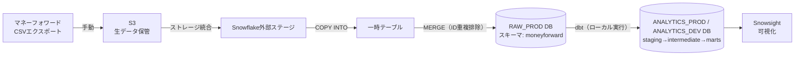

# アーキテクチャ設計書

## 概要
本書は、本データ基盤の技術スタックとインフラ構成を定義する。命名規則・レイヤー処理範囲・データ品質基準・Git規約は`docs/development-standards.md`に委譲し、本書は「どのサービスを使い、どう組み合わせるか」に専念する。

## 全体構成図

## 技術スタック

| 層 | 用途 | 採用サービス |
|---|---|---|
| データ取得 | マネーフォワードからのCSVエクスポート | 手動ダウンロード |
| 生データ保管 | 実データ（CSV）の保管 | Amazon S3 |
| DWH | データの保管・変換の実行基盤 | Snowflake（クラウド：AWS、リージョン：ap-northeast-1（東京）、エディション：Standard） |
| 変換 | RAW_PRODからANALYTICS_PRODへの加工 | dbt（ローカル実行） |
| 可視化 | 分析結果の閲覧 | Snowsight（不便な場合は別途見直す） |

## データフロー

1. マネーフォワードからCSVを手動エクスポートし、S3にアップロードする（`docs/repository-structure.md`の通り、実データはGit管理対象外）
2. SnowflakeとS3を**ストレージ統合（Storage Integration）**で接続する。認証キーを直接扱わず、AWS IAMロールをSnowflakeが引き受ける方式とする
3. `COPY INTO`でS3のCSVを一時テーブルに読み込む。ファイルフォーマット設定でShift-JISを指定し、UTF-8として取り込む
4. 一時テーブルからRAW_PRODテーブルへ、`ID`列（`docs/development-standards.md`の`transaction_id`に対応）をキーに`MERGE`する。これにより、同一期間のCSVを再取り込みしても重複が残らない状態をRAW_PRODの時点で担保する（完全な生データ履歴はS3の生ファイルに委ねる）
5. dbt（ローカルPCから実行）が、RAW_PRODを読み取りANALYTICS_PROD（またはANALYTICS_DEV）のstaging/intermediate/marts層を作成・更新する
6. Snowsightでmartsのデータを閲覧する

## Snowflakeデータベース・スキーマ構成
本番環境には`_PROD`、開発環境には`_DEV`を付け、名前だけでどちらか判別できるようにする（`docs/development-standards.md`の命名規則の考え方と整合させる）。

| データベース | スキーマの切り方 | 役割 |
|---|---|---|
| `RAW_PROD` | 取得元システムごと（例：`moneyforward`） | 取り込んだ生データを保持する（本番）。source時点で重複排除済み |
| `RAW_DEV` | 取得元システムごと（例：`moneyforward`） | 取り込みロジック（`COPY INTO`/`MERGE`）およびdbtモデルの開発・動作確認用 |
| `ANALYTICS_PROD` | レイヤーごと（`staging`/`intermediate`/`marts`） | dbtによる変換結果（本番相当） |
| `ANALYTICS_DEV` | レイヤーごと（`staging`/`intermediate`/`marts`） | dbtによる変換結果（開発中） |

- スキーマをレイヤー単位で切る方針は`docs/development-standards.md`の1.8で定義済み
- ステージング環境（dev/prodの中間の検証環境）は設けない。個人開発でリリース工程が薄いため過剰と判断（`docs/development-standards.md`のGit規約でdevelopブランチを設けなかった判断と同様）

## 環境分離
- 開発環境（`RAW_DEV`/`ANALYTICS_DEV`）と本番環境（`RAW_PROD`/`ANALYTICS_PROD`）は、データも権限も完全に分離する。**環境を跨いだ参照は行わない**（開発環境が本番環境のデータを直接読みに行くことはしない）
- dbtの`target`（`dev`／`prod`）に連動させ、`sources.yml`の参照先データベースも含めて、`RAW_DEV`/`ANALYTICS_DEV`のセットと`RAW_PROD`/`ANALYTICS_PROD`のセットを丸ごと切り替える
- 開発環境（`RAW_DEV`）は、通常`sample_data/`のダミーCSVで検証する。dbtモデルの開発でリアルなデータのボリューム・パターンが必要になった場合のみ、**必要な分だけ本番データを一時的に投入し、確認が終わったら直ちに削除する**。常時複製（クローン等）はしない

## ロール・権限設計
Snowflakeの操作者は自分（tomitayuki）のみであり、ユーザーは1つ作成し、目的別のロールを付与して`USE ROLE`で切り替える。Claude Codeがローカルでdbt等を実行する場合も、同じユーザー・ロールの仕組みをそのまま利用する（Claude Code専用のユーザーは設けない）。

環境分離の方針に合わせ、書き込み・参照を伴うロールはすべて環境ごと（`_DEV`/`_PROD`）に分割し、環境を跨いだ権限を持たせない。

| ロール | 想定される利用場面 | 参照 | 書き込み |
|---|---|---|---|
| `LOADER_DEV` | 取り込みロジック（`COPY INTO`/`MERGE`）の開発・動作確認 | - | `RAW_DEV` |
| `LOADER_PROD` | S3→RAWの本番取り込み処理 | - | `RAW_PROD` |
| `TRANSFORMER_DEV` | dbtを開発環境（`target: dev`）で実行する時 | `RAW_DEV` | `ANALYTICS_DEV` |
| `TRANSFORMER_PROD` | dbtを本番環境（`target: prod`）で実行する時 | `RAW_PROD` | `ANALYTICS_PROD` |
| `REPORTER_DEV` | Snowsightで開発中のmartsを確認する時 | `ANALYTICS_DEV.marts` | - |
| `REPORTER_PROD` | Snowsightで本番のmartsを閲覧する時 | `ANALYTICS_PROD.marts` | - |

いずれのロールもウェアハウスの利用権限（`USAGE`）を持つ。

将来、取得元システムが増えた場合（`docs/backlog.md` 018番等）は、`LOADER_PROD`をシステムごとに分割する余地がある。`TRANSFORMER`／`REPORTER`は、dbtプロジェクト・利用者がともに単一である限り、環境以外の軸での分割の必要は薄い。

### アカウントセキュリティ
- Snowflakeの個人ユーザーには多要素認証（MFA）を有効化する。要件定義書の「自分以外アクセスできない状態を維持する」を担保する一環とする

## コンピュートリソース

### ウェアハウス
- サイズ：**X-Small**（本基盤のデータ量・同時実行数はいずれも最小構成で十分なため）
- クラスタ構成：シングルクラスタ（同時アクセスは自分1人のみ）
- 自動停止：60秒
- 用途別に分割せず、共有で1つのみ作成する

### リソースモニター
- 月間のクレジット使用量に対して、25%／50%／75%到達時に通知、100%到達時にウェアハウスを自動停止する
- 契約時のクレジット単価をもとに、月額1,000円未満（`docs/requirements.md`の制約条件）に収まる上限クレジット数を設定する
